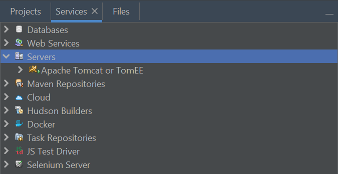
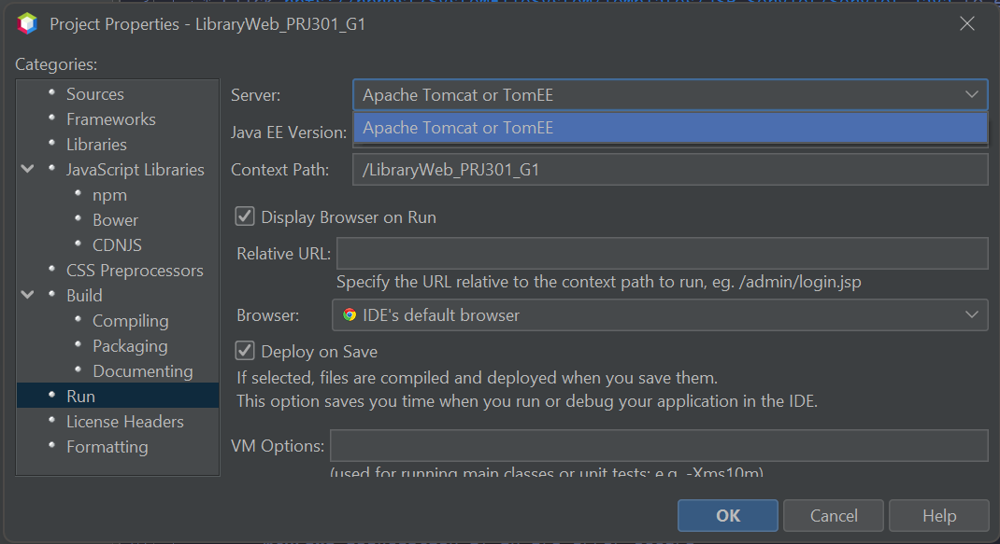
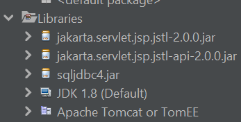

# Các bước thêm server thủ công vào một Project NetBeans

## Yêu cầu:

- Bạn đã cài Apache Tomcat 10.0.27 và đã clone project từ GitHub.
- Đã add Apache Tomcat 10.0 vào NetBeans (xem [Hướng dẫn cài Tomcat](https://youtu.be/KnkKZ2zDfIM)).
- Đảm bảo như sau:

    

## Hướng dẫn từng bước:

- Mở project bạn đã clone.
- Click chuột phải vào project → `Properties`.
- Chọn tab `Run` (hoặc "Server" trong bản cũ).
- Ở phần `Server`: chọn như hình.

    
- Bấm OK
- Kết quả:

    
