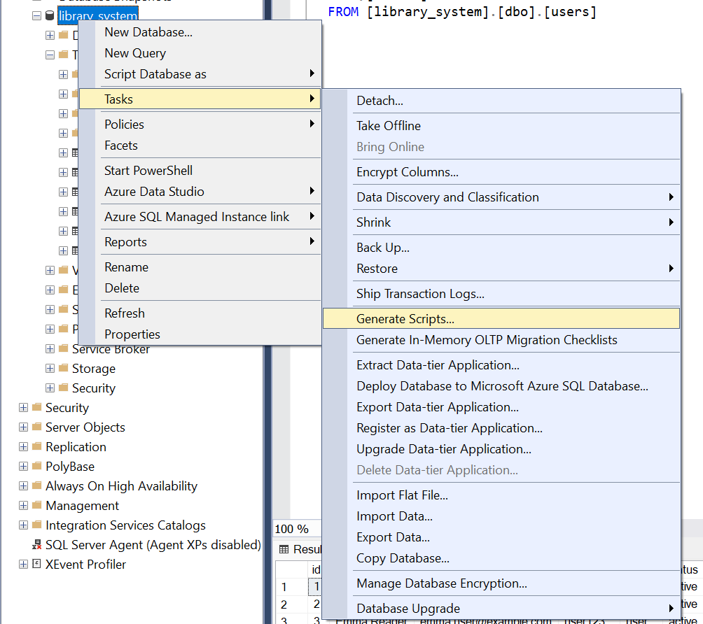
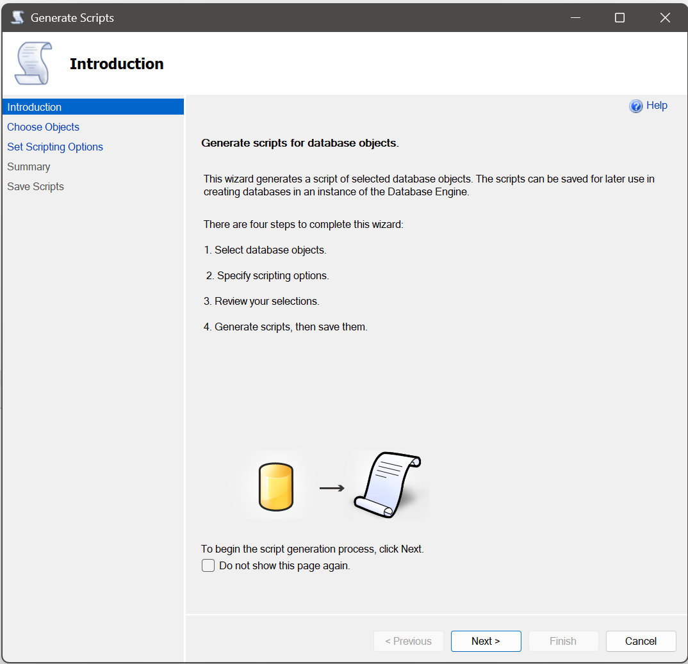
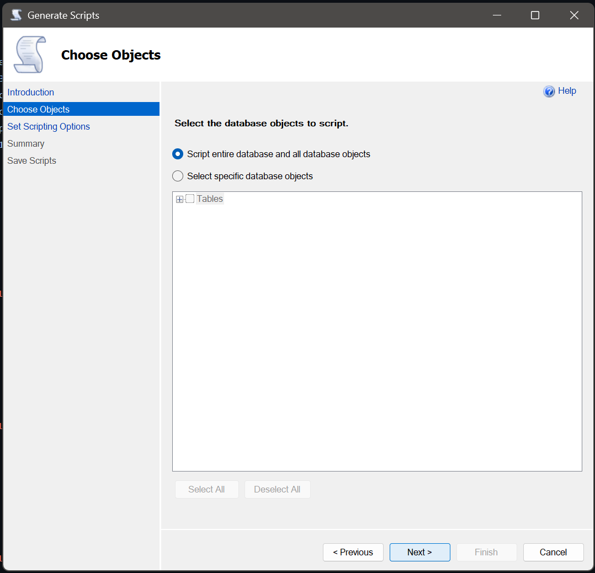
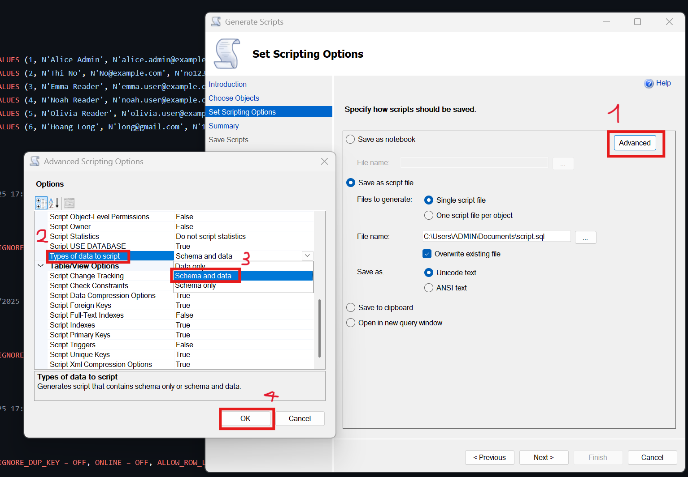
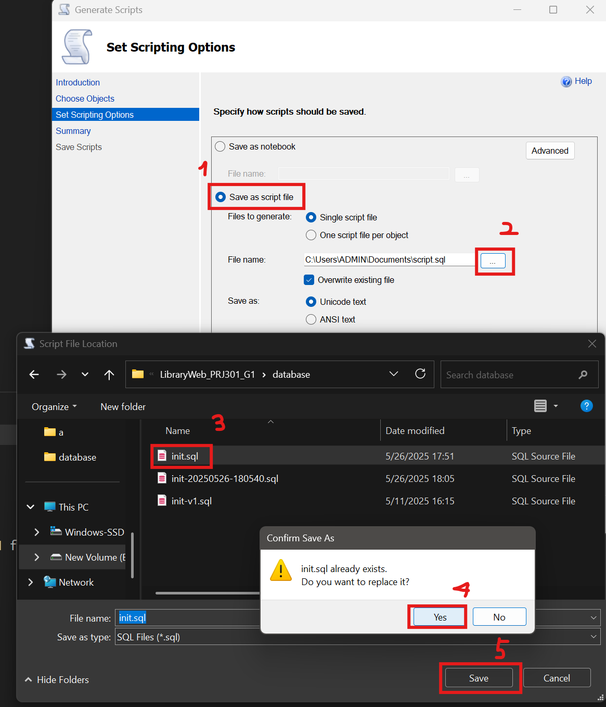
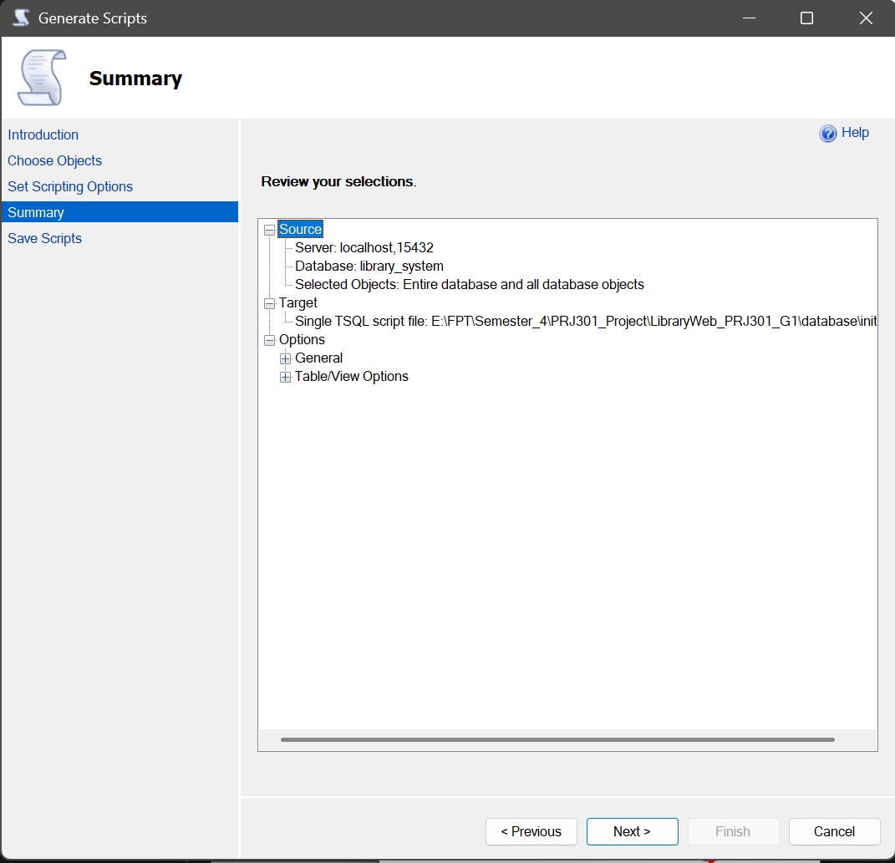
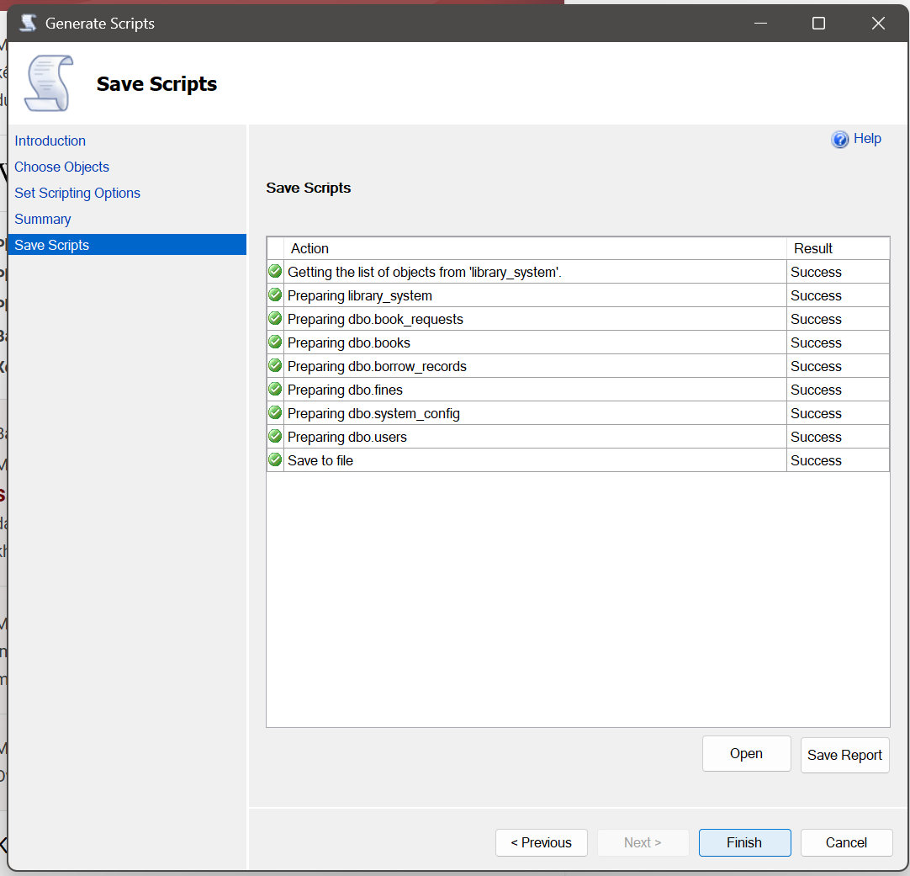

# Hướng dẫn Generate Scripts (.sql) trong SSMS

> Mục tiêu: Xuất toàn bộ **database schema + dữ liệu** ra file `.sql` để dùng trong Docker (init lại database cho toàn
> team).

## Khi nào cần làm?

- Sau khi bạn **chỉnh sửa table**, thêm dữ liệu mẫu, thay đổi cấu trúc…
- Trước khi chạy `make restart`
- Khi muốn chia sẻ phiên bản database hiện tại cho cả nhóm

## Step 1: Xuất database thành file `.sql`

<details>
<summary>Xem chi tiết</summary>

### 1. Mở Generate Scripts

- Chuột phải vào database `library_system` → chọn Tasks → Generate Scripts...



### 2. Bỏ qua Introduction

- Nhấn **Next**.



### 3. Chọn đối tượng để export

- Nhấn **Next**.



### 4. Cấu hình nâng cao

- Tại bước "Set Scripting Options" → chọn **Advanced** (góc phải).
- Chọn xong click **Ok**.



### 5. Lưu file `.sql`

- Chọn đường dẫn: `./database/init.sql` (**ghi đè file cũ**)
- Nhấn **Next → Finish**



### 6. Còn lại



</details>

## Step 2: Tạo bản sao lưu database

```bash
make db-backup

```

→ Tạo bản sao như: `database/init-20250526-185211.sql`
