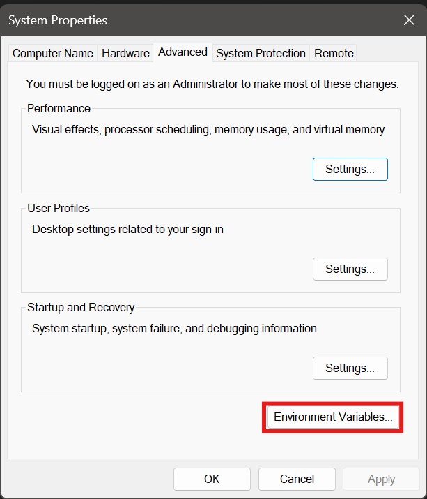
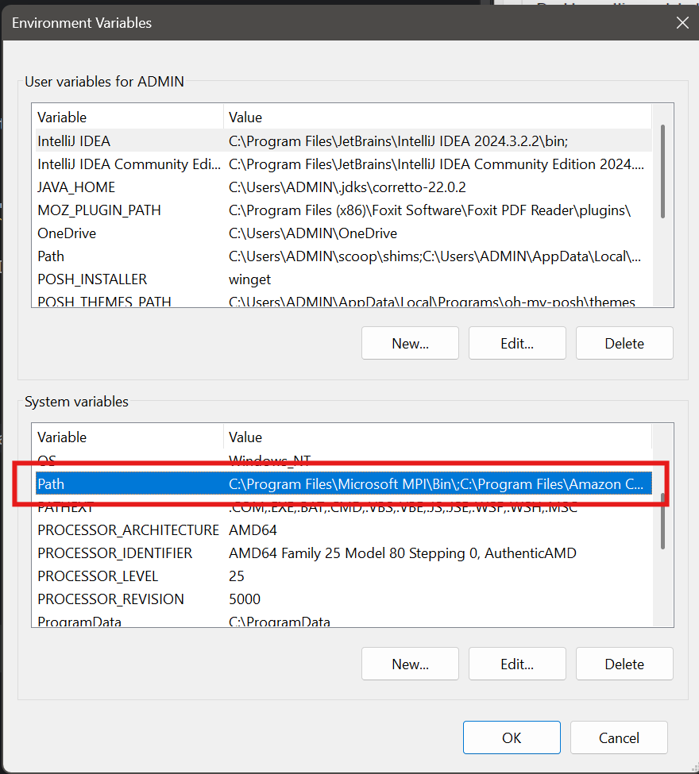

# Hướng Dẫn Cài make Bằng GnuWin32

## Bước 1: Tải make cho Windows

- Mở trình duyệt và truy cập link sau: https://gnuwin32.sourceforge.net/downlinks/make.php

## Bước 2: Cài đặt

- Mở file lên rồi spam `Next` cho đến khi hoàn tất.

## Bước 3: Thêm make vào PATH

- Nhấn `Windows + R` để mở hộp thoại Run

- Dán lệnh sau:

    ```text
    SystemPropertiesAdvanced
    ```

- Nhấn `Enter`

- → Thẳng vào tab Advanced trong System Properties
- → Bấm nút `Environment Variables...`

    

- Ở phần `System variables`, tìm dòng `Path`, Double click vào nó

  

- Nhấn `New` → dán đường dẫn:

    ```text
    C:\Program Files (x86)\GnuWin32\bin
    ```
- Nhấn `OK` để lưu lại và `OK` thoát ra các cửa sổ.
