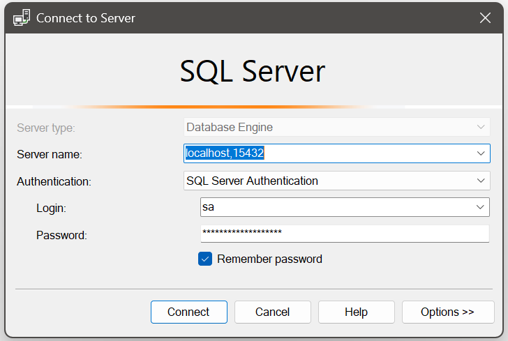

# 📚 LibraryWeb_PRJ301_G1

A full-stack **Library Management System** built with **Java Servlet**, **JSP**, and **SQL Server**, using **Docker
Compose** and a clean, simple **Makefile-based workflow** for easy development and collaboration.

> ✅ Mọi thành viên cần sử dụng **Git Bash** khi chạy lệnh, và làm việc trên **nhánh phụ** – không commit trực tiếp lên
`main`.

---

## Flow làm việc chuẩn

### 1. Tạo nhánh riêng để làm việc

```bash
git checkout -b <ten-nhanh-cua-ban>

```

Khi xong, push và tạo **Pull Request (PR)** về `main`.

----------

### 2. Khởi động dự án

```bash
make restart

```

----------

### 3. ⚠️ Nếu bạn chỉnh sửa database (schema hoặc dữ liệu)

> [Xem hướng dẫn xuất database thành file .sql tại đây](GEN_SCRIPT_GUIDE.md)

----------

### 3. Truy cập ứng dụng

- Web app: [http://localhost:8080/LibraryWeb_PRJ301_G1](http://localhost:8080/LibraryWeb_PRJ301_G1)

- Tomcat Manager: [http://localhost:8080/manager/html](http://localhost:8080/manager/html)
    - Tài khoản: `admin` / Mật khẩu: `admin`

----------

### 4️⃣ Kết nối CSDL

Dùng DBeaver, Azure Data Studio hoặc SSMS:

| Thông tin     | Giá trị                           |
|---------------|-----------------------------------|
| Host          | `localhost`                       |
| Port          | `1433`                            |
| User          | `sa`                              |
| Password      | `YourStrong!Passw0rd`             |
| Database name | `library_system` (xem `init.sql`) |

<details>
<summary>🖼️ Xem hình ảnh</summary>

</details>

----------

## 🧱 Cấu trúc Makefile hỗ trợ

> [Xem chi tiết tất cả lệnh Makefile tại đây](MAKEFILE.md)

----------

## 📦 Công nghệ sử dụng

- Java Servlet (JDK 1.8.0_172)

- Apache Tomcat 10.0.27

- Microsoft SQL Server 2019 (Docker)

- JSP + JSTL (2.0.0)

- Docker & Docker Compose

- Makefile (build automation)

----------

## 👥 Thành viên nhóm – Group 1

- SE190377 – Phùng Lưu Hoàng Long

- SE192850 – Trần Sanh Điền

- SE192515 – Nguyễn Lê Phúc Nguyên

----------

## 📌 Lưu ý

```text
- Luôn dùng Git Bash để chạy lệnh make
- Không commit các file: *.class, *.iml, dist/*.war
- Nếu chỉnh sửa database/init.sql → chạy make db-backup trước

```
